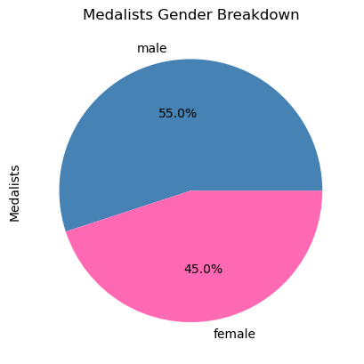

# Tidy Data Project

## Project Overview 
This project explores the **2008 Olympic medalist** dataset while applying tidy data principles to make the data easier to analyze. The original dataset includes information on the name of each Olympic Medalist in the rows and event_gender as the columns. It is important to highlight that **each medalist only competed in one event** and therefore **only one column per row had information**, the rest was NaN values (events that they didn’t compete in). As a result, going through the tidy data process was crucial. The goal is to **follow the tidy data principles** by structuring the dataset into a long format, seprating columns with more than one variable and dropping NaN, allowing for efficient summarization, visualization, and analysis of medal distributions across events and by gender.

## Key Objectives:
- Clean and restructure the dataset to reduce sparsity.
- Investigate trends in medal distributions.
- Use graphs and pivot tables Analyze gender representation and medal breakdown in Olympic events.

## Instructions 

## References
- Tidy Data, Journal of Statistical Software, 1-24: https://vita.had.co.nz/papers/tidy-data.pdf
- Pandas Cheat Sheet : https://pandas.pydata.org/Pandas_Cheat_Sheet.pdf
    - These resources helped understand the structure of a tidy data set and run the commands that clean the dataset.
- Two Bronze Medals Explained: Why Some Olympic Events Have Multiple Bronze Winners: https://www.nbcbayarea.com/paris-2024-summer-olympics/two-bronze-medals-explained-olympics/3617259/
    - This article provided insights into medal distribution patterns, particularly why some events award multiple bronze medals which seemed odd in the beggining.

## Dataset Description 
### Data Source  
- The dataset consists of 2008 Olympic medalists, including athlete names, genders, sports, and medal types.
- The original data was in a wide format, with each column representing a combination of gender and event (e.g., male_archery, female_athletics), leading to high sparsity.

### Pre-processing Steps
- **Melting the Data:** Converted the dataset into a long format where each row represents a single athlete. The columns where transformed to be gender_event, and medal type.
- **Handling NaNs:** Missing values were removed because each athlete only competed in one event, making empty columns redundant.
- **Splitting Columns:** Gender and event were split into separate columns (from 1 gender_event column to 2 columns: gender and event) for easier analysis.

## Key Findings
### Medal Count by Event
- Bronze medals were awarded more frequently than gold and silver, likely due to ties or multiple bronze winners in some sports. 
    
- Events with the most medalists tend to be team sports or those with multiple categories, such as athletics, rowing, and swimming.
    

### Gender Representation
- In most events, there where more male medalist than female medalists, while some events only had male competitions. The gap aligns with historical participation disparities, as women's events were introduced later and often had fewer categories.
    
- In the 2008 Olympics Male medalists slightly outnumbered Female medalists (55% vs. 45%).

    

### Patterns in Medal Allocation
Three common medal distribution patterns were identified throught the pivot table aggregation:
1.	**Equal distribution (33.3% each):** Common in structured competitions with clear podium placements.
2.	**Unequal distribution:** Some events had skewed medal allocations due to performance dominance.
3.	**25-25-50 split (Two bronze medals awarded):** Common in combat sports (boxing, judo, wrestling, taekwondo) due to the elimination of bronze medal matches in 1950, ensuring both losing semifinalists receive a medal.

