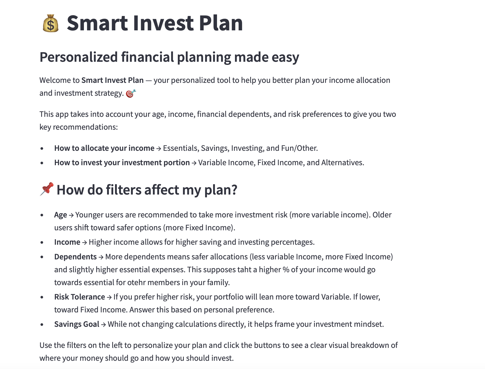

# Investment Plan

## Introduction

I've always been curious about finance and investing, but for a long time, I never really knew where to start. There are so many possible investment, but as a beginner I never found a tool that felt easy to understand. In fact, most of the tools I found were designed for experts or people already deep into investing.

That's why I built **EasyInvest Planner**: A beginner-friendly tool to help people like me make their first personalized financial plan.  
It focuses on helping you understand two important things:
- How to divide your income wisely (Essentials, Savings, Investing, Fun)
- How to invest the portion of money you choose to invest

To make it easier for beginners, the app also breaks investments into the three main asset classes to give beginners actionable insights of what investments they should be prioritizing:

- **Variable Income (Stocks)** → These are higher-risk, higher-reward investments. Stocks can go up or down quickly, but over time, they have historically grown the most. Great for long-term growth.

- **Fixed Income (Bonds)** → These are safer investments that give steady returns. Bonds are like loans you give to companies or governments, and they pay you back with interest. Less risky, but also lower returns.

- **Alternatives (Real Estate, etc.)** → These don't move like stocks or bonds. Alternatives include real estate, commodities, or other assets. They're good for diversifying your portfolio so not all your money is affected the same way by market changes, despite typically being high risk.

---

## Project Overview

### What is this App?

**EasyInvest Planner** is a simple and personalized financial planning tool built with Streamlit to help users make better decisions about how to allocate their income and structure their investments.

By inputting personal and financial details like age, income, dependents, and risk tolerance, users can generate:

- A clear budget breakdown across spending, saving, investing, and fun/other categories.
- A recommended investment allocation across Variable Income, Fixed Income, and Alternatives.
- Specific investment suggestions tailored to their profile and risk level.

Whether you're new to investing or just want structured guidance, this app helps make financial planning intuitive and visual.

---
## Instructions

### Installation
#### To run the app locally, follow the steps below:
1. Open terminal inside main portafolio (MEJIA-Python-Portfolio)
2. Run ‘pip install pipreqs’ command
2. Navigate to the NERStreamlitApp folder:
  - ‘cd MEJIA-PYTHON-PORTFOLIO/Computing II/StreamlitAppFinal’
3. Run ‘ls’ command to check you are in the right folder (should be StreamlitAppFinal)
4. Run ‘pipreqs’ command to create text file in folder 
5. Run  ‘streamlit run EasyInvest.py’ to open stremlit browser

#### Link to deployed version
FALTA ADD

---

## App Features

### Step 1: Personalize Your Plan

Users input their:

- Age
- Annual Income
- Number of Financial Dependents
- Risk Tolerance
- Savings Goal

These details dynamically affect recommendations. For example:

- Younger users are suggested to take on more Variable Income investments.
- Users with more dependents are steered towards more Fixed Income for safety.

ACA FOTO DE LOS FILTERS

---

### Step 2: See Where Your Money Goes (Income Allocation)

The app calculates a recommended breakdown of the user's income for:

- Essentials
- Saving
- Investing
- Fun & Other

A bar chart visually displays this breakdown either monthly or yearly, depending on user selection. The app also provides exact dollar amounts in text format.

ACA FOTO DEL BAR GRAPH

---

### Step 3: See How You Should Be Investing

Based on the user profile, the app recommends an investment allocation split into:

- Variable Income
- Fixed Income
- Alternatives

This allocation is shown in a pie chart to provide a quick overview of where the user's investment funds should be directed.

ACA FOTO DEL PIE CHART

---

### Step 4: Your Personalized Investment Plan

Finally, the app offers tailored investment recommendations based on the calculated allocation.

ACA FOTO DEL FINAL RECCOMENDATIONS

---

## References & Resources

- [Streamlit Documentation](https://docs.streamlit.io/)
- [Matplotlib Documentation](https://matplotlib.org/stable/index.html)
- [Investopedia S&P 500 Explanation](https://www.investopedia.com/terms/s/sp500.asp)

